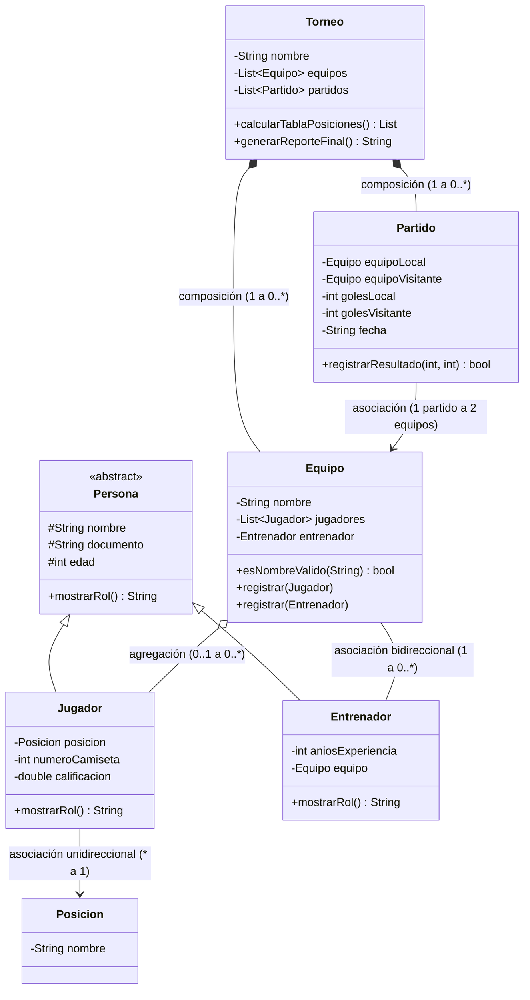
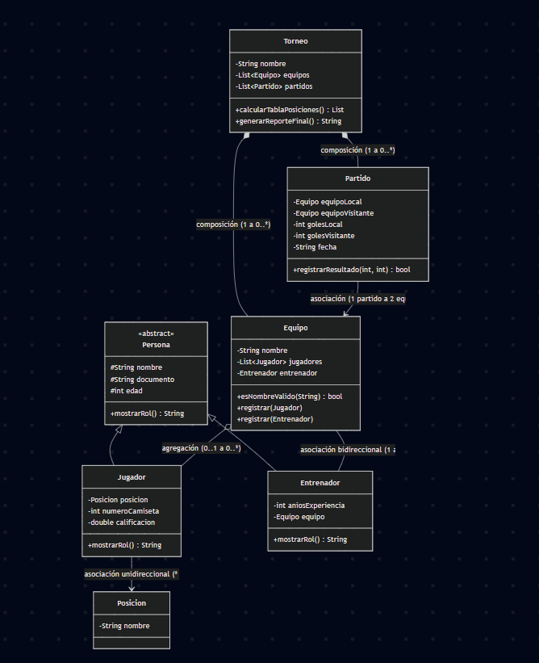
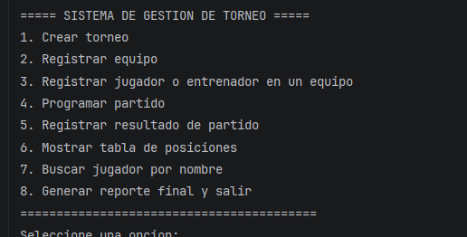
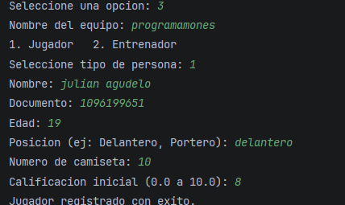
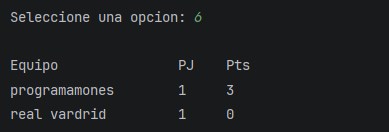
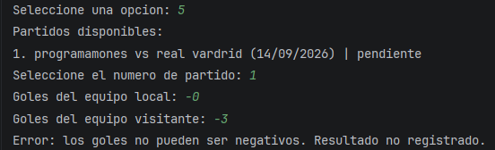

# Sistema de Gestión de un Torneo Deportivo

Reto integrador — Programa de consola en Java para administrar un torneo deportivo:
registro de equipos, jugadores y entrenadores, programación de partidos, captura de
resultados y cálculo de la tabla de posiciones.

## Integrantes

- Julian Andres Agudelo Vega — julian-agudelo-vega
- Keyner Andres Sepulveda Torres — KeynerSepulveda929


## Descripción del sistema

El programa corre completamente por consola mediante un menú en bucle. Permite:

1. Crear un torneo.
2. Registrar equipos dentro del torneo (sin nombres vacíos ni repetidos).
3. Registrar jugadores o entrenadores dentro de un equipo.
4. Programar partidos entre equipos ya registrados.
5. Registrar el resultado de un partido (validando que los goles no sean negativos).
6. Mostrar la tabla de posiciones ordenada de mayor a menor puntaje.
7. Buscar un jugador por nombre (usando `equalsIgnoreCase`).
8. Generar un reporte final del torneo (con `StringBuilder`) y salir.

## Cómo ejecutarlo

Requiere JDK 8 o superior instalado.

```bash
# 1. Clonar el repositorio
git clone <URL-del-repositorio>
cd torneo-deportivo

# 2. Compilar todas las clases dentro de src/, generando los .class en bin/
javac -d bin $(find src -name "*.java")

# 3. Ejecutar el programa
java -cp bin com.torneo.app.Main
```

En Windows (PowerShell), si `find` no está disponible, se puede compilar así:

```powershell
javac -d bin src/com/torneo/modelo/*.java src/com/torneo/util/*.java src/com/torneo/app/*.java
java -cp bin com.torneo.app.Main
```

## Estructura del proyecto

```
torneo-deportivo/
├── README.md
├── .gitignore
└── src/
    └── com/torneo/
        ├── modelo/
        │   ├── Persona.java        (clase abstracta)
        │   ├── Jugador.java        (extends Persona)
        │   ├── Entrenador.java     (extends Persona)
        │   ├── Posicion.java
        │   ├── Equipo.java
        │   ├── Partido.java
        │   ├── Torneo.java
        │   └── Notificable.java    (interfaz - extensión opcional)
        ├── util/
        │   └── Historial.java      (clase genérica - extensión opcional)
        └── app/
            └── Main.java           (menú de consola)
```

## Diagrama de clases




## Relaciones entre clases: qué elegimos y por qué

| Clase A | Clase B | Relación | Multiplicidad | Por qué |
|---|---|---|---|---|
| Torneo | Equipo | Composición | 1 a 0..* | Los equipos de este sistema solo existen dentro de un torneo concreto; si el torneo se elimina, no tiene sentido conservarlos sueltos. |
| Torneo | Partido | Composición | 1 a 0..* | Un partido se programa siempre dentro de un torneo específico; no existe fuera de él. |
| Equipo | Jugador | Agregación | 0..1 a 0..* | Un jugador pertenece a un equipo, pero conceptualmente podría existir el registro de la persona sin ese equipo (por ejemplo, si cambia de equipo). Es una relación "todo-parte" más débil que la composición. |
| Equipo | Entrenador | Asociación bidireccional | 1 a 0..* | El equipo conoce a su entrenador y el entrenador conoce a qué equipo dirige; ambos objetos necesitan navegar hacia el otro. |
| Jugador | Posición | Asociación unidireccional | * a 1 | Muchos jugadores pueden compartir la misma posición, y el jugador necesita saber su posición, pero la posición no necesita saber qué jugadores la tienen. |
| Partido | Equipo | Asociación | 1 partido a 2 equipos | Un partido simplemente hace referencia a dos equipos que ya existen de forma independiente; ninguno de los dos es "dueño" del otro. |

## Puntos de control técnico cubiertos

- **Encapsulamiento:** todos los atributos son `private`/`protected`, con getters/setters que validan antes de asignar.
- **Estructuras de decisión:** `if/else`, `else if` en validaciones; `switch` en el menú principal.
- **Estructuras repetitivas:** `do-while` para el bucle del menú; `for`/`for-each` para recorrer equipos, jugadores y partidos.
- **`break`/`continue`:** `continue` al omitir partidos sin jugar (cálculo de tabla) y equipos sin jugadores (búsqueda); `break` etiquetado al encontrar un jugador en la búsqueda.
- **Conversión de datos:** `leerEntero()` y `leerDouble()` en `Main` convierten la entrada de `Scanner` (String) a `int`/`double`, con reintento si el dato no es válido.
- **Método estático de validación:** `Equipo.esNombreValido(String nombre)`.
- **Colecciones:** `List<Equipo>`, `List<Jugador>`, `List<Partido>` (`ArrayList`).
- **Herencia y polimorfismo:** `Persona` es abstracta; `Jugador` y `Entrenador` la extienden y sobrescriben `mostrarRol()` con `@Override`.

## Extensiones opcionales implementadas

- **Sobrecarga de métodos:** `Equipo.registrar(Jugador)` y `Equipo.registrar(Entrenador)`.
- **Interfaz `Notificable`:** con un método `default` (`notificarConFecha`) y uno `static` (`formatoEstandar`), implementada por `Equipo`.
- **Clase genérica `Historial<T>`:** usada en `Main` como `Historial<String>` para registrar el historial de eventos del sistema (creación de torneo, registros, resultados).

## Evidencia de ejecución

> ✏️ Antes de entregar, ejecuten el programa y peguen aquí capturas de pantalla reales:

**1. Menú funcionando**



**2. Registro exitoso (equipo o jugador)**



**3. Tabla de posiciones calculada**



**4. Validación rechazando un dato inválido** (por ejemplo, goles negativos o nombre de equipo vacío)




